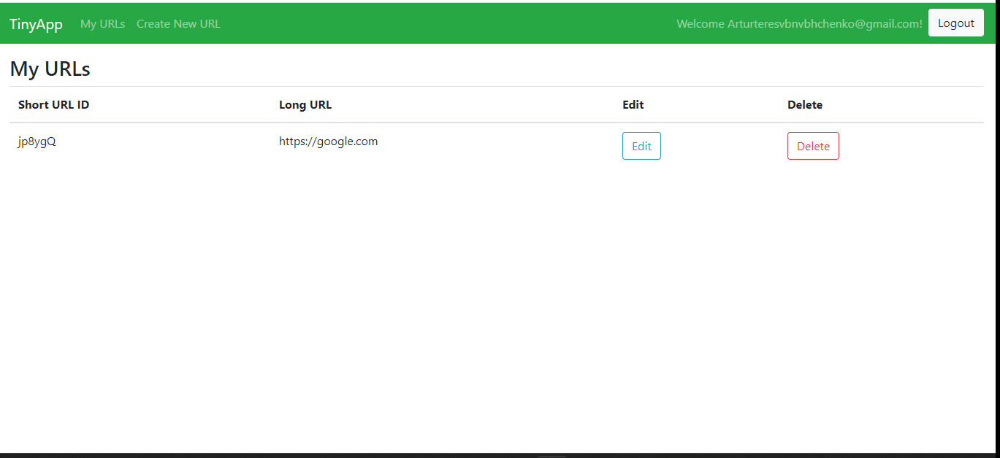

## **TinyApp**
----
TinyApp is a full stack web app built with Node and Express that allows users to shorten long URLs (similar to [TinyURL](https://tinyurl.com/app), [Bitly](https://bitly.com/).)

This application was created by [Artur Tereshchenko](https://github.com/mr-Arturio) as part of the Lighthouse Labs Web Development Bootcamp.

### **Application preview**
------------


#### Register
---


### Login
---


### Create
---


### My URLs
---


## How to Lunch

* Clone this repository
* Install all dependencies (```npm install```)
  * Node.js
  * Express
  * EJS
  * nodemon
  * bcrypt
  * cookie-session
  * method-overide
* Run server with ```node express_server.js```  or ```npm start``` with ```nodemon```
* Open TinyApp at 